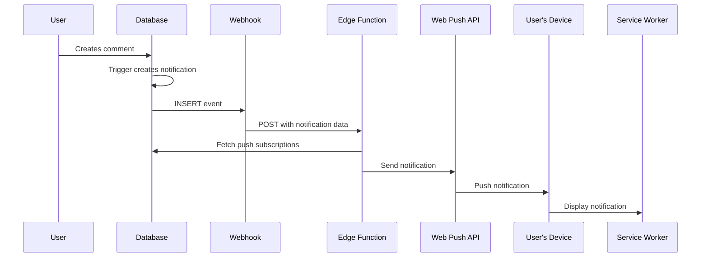

# Push Notifications - Quick Start Guide

## TL;DR

Push notifications work via **Supabase Database Webhooks** → **Edge Function** → **Web Push API**

## Deployment (5 steps, ~10 minutes)

### 1. Apply Migration

```bash
supabase db push
```

### 2. Deploy Edge Function

```bash
supabase functions deploy send-push-notification
```

### 3. Set Secrets

```bash
# Generate VAPID keys first (if you haven't):
npx web-push generate-vapid-keys

# Set the secrets
supabase secrets set VAPID_PUBLIC_KEY="BN..."
supabase secrets set VAPID_PRIVATE_KEY="..."
supabase secrets set VAPID_SUBJECT="mailto:notifications@yipyap.app"
```

### 4. Configure Webhook (Dashboard)

Go to: **Supabase Dashboard → Database → Webhooks → Create a new hook**

```
Name: send-push-notification
Table: notifications
Events: ✓ Insert
Method: POST
URL: https://[project-ref].supabase.co/functions/v1/send-push-notification

Headers:
  Authorization: Bearer [service-role-key]
  Content-Type: application/json

Advanced:
  Timeout: 5000ms
  Retry: Enabled
  Max Retries: 3
```

### 5. Test

Create a comment in your app → should trigger push notification

## Monitoring

### Check Webhook Fired
Dashboard → Database → Webhooks → send-push-notification → Logs

### Check Edge Function Ran
Dashboard → Edge Functions → send-push-notification → Logs

### Check Delivery Status
```sql
SELECT * FROM push_notification_delivery_log
ORDER BY created_at DESC LIMIT 10;
```

## Troubleshooting

| Issue | Solution |
|-------|----------|
| Webhook not firing | Check webhook enabled, table name is `notifications` |
| Edge function error | Check VAPID keys set: `supabase secrets list` |
| Push not received | Check subscription: `SELECT * FROM push_subscriptions WHERE user_id = '...'` |
| Invalid JWT | Verify service role key in webhook Authorization header |

## What's Happening



## Webhook Payload Example

The webhook sends this to your edge function:

```json
{
  "type": "INSERT",
  "table": "notifications",
  "record": {
    "id": "...",
    "user_id": "...",
    "type": "reply_to_post",
    "actor_subway_line": "A",
    "preview_content": "This is a reply",
    ...
  }
}
```

The edge function automatically:
1. Parses the webhook payload
2. Builds notification title/body based on type
3. Fetches user's push subscriptions
4. Sends push to all subscribed devices
5. Removes expired subscriptions

## Files Modified

- ✅ `/supabase/functions/send-push-notification/index.ts` - Webhook support added
- ✅ `/supabase/migrations/20251001030000_remove_pgnet_trigger_use_webhooks.sql` - Trigger removed

## Production Checklist

- [ ] Migration applied (`supabase db push`)
- [ ] Edge function deployed (`supabase functions deploy send-push-notification`)
- [ ] VAPID secrets set (`supabase secrets set ...`)
- [ ] Webhook configured in Dashboard
- [ ] Test notification received
- [ ] Monitoring set up (check logs)

## Cost

**Supabase Free Tier:**
- 500K edge function calls/month
- Unlimited webhooks
- Free Web Push (uses browser APIs)

**Your Usage (estimated):**
- 1,000 users × 5 notifications/day × 30 days = 150K calls/month
- **Result:** 70% under free tier limit ✅

## Support

Full documentation:
- `/docs/PUSH_NOTIFICATION_ARCHITECTURE.md` - How it works
- `/docs/PUSH_NOTIFICATION_DEPLOYMENT.md` - Detailed deployment
- `/docs/PUSH_NOTIFICATION_SUMMARY.md` - Complete summary

Questions? Check the troubleshooting section or Supabase logs.
